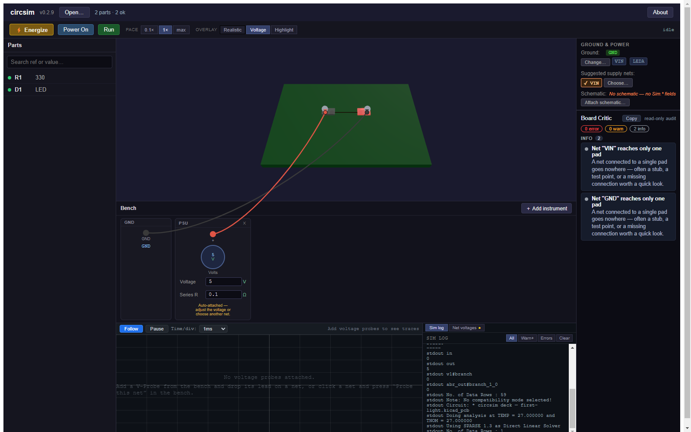
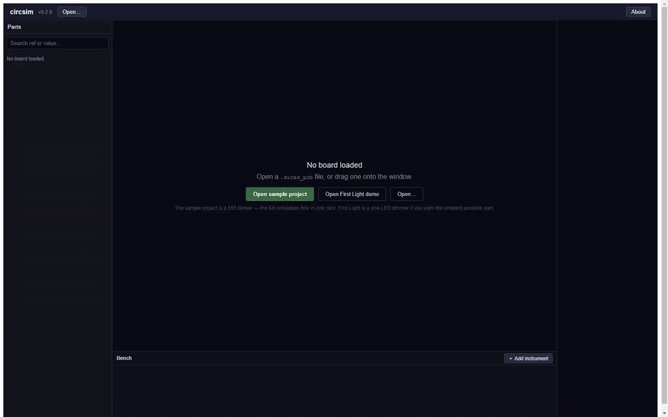

# circsim

**Simulate and audit any routed KiCad board.** circsim is a desktop app (Windows / macOS / Linux) that opens a routed KiCad board (`.kicad_pcb`), rebuilds the circuit from the copper, renders it in 3D, and runs an interactive SPICE bench on it: apply power, turn a knob, probe nets on the physical board. A read-only Board Critic audits the layout for fabrication risks. You get both before you pay for fabrication.

Open the board and press Energize. You do not assign `Sim.*` fields first, and the bundled model library matches parts by part number, value, and footprint, flagging the ones it cannot match instead of guessing. circsim is fully offline, MIT-licensed, and **never modifies your design files.**

Documentation: **[epim.github.io/circsim](https://epim.github.io/circsim/)**. It has the install guide, the First Light tutorial, task how-tos, and the full reference.
Download: **[latest release](https://github.com/epim/circsim/releases/latest)** (Windows `.exe`, macOS `.dmg` x2, Linux `.AppImage` / `.deb`).





More screenshots, and what circsim reads out of sixteen KiCad-written boards from KiCad 6 through 10, are in the [gallery](https://epim.github.io/circsim/gallery).

## What it does

- **Starts from the routed board.** Net connectivity comes straight out of the `.kicad_pcb`, KiCad 6 to 10. The board can come from your own KiCad project, a contractor, or an autorouter such as [Quilter](https://quilter.ai) that returns a KiCad board; circsim has no Quilter-specific code. The [supported files](https://epim.github.io/circsim/reference/file-formats#kicad-version-support) page lists the KiCad-written boards behind the version range, including the one it rejects.
- **The schematic is an optional input.** Keep the `.kicad_sch` next to the board with the same name and circsim attaches it on open. Its `Sim.*` fields are the first model source and its pin names settle diode and LED polarity. Only the root sheet is read, so parts on hierarchical sub-sheets get neither. A BOM CSV pins down exact parts.
- **A real bench.** Clip a DC supply, function generator, potentiometer, logic input, and voltage/current probes onto the board by drawing leads from front-panel jacks to the copper. Turn a knob and the simulation re-solves live.
- **A read-only Board Critic on the layout.** It audits the board circsim did *not* design for floating nets, clearance, decoupling distance, loop area, IR-drop, ampacity, and thermal risk, and never edits your files. The simulation itself treats each net as one ideal node, so copper resistance appears in the Critic's estimates and not in the simulated voltages.
- **Honest about what it knows.** Behavioral vs. primitive models, stubbed ICs, MCUs as interactive-pin panels (firmware doesn't run), convergence fallbacks, and fidelity limits are always visible. See [what circsim can and can't tell you](https://epim.github.io/circsim/concepts/fidelity). The same page ships inside the app.

Powered by [ngspice](https://ngspice.sourceforge.io/) 46, bundled per platform and run crash-isolated in a separate process. Nothing to install; no network calls, ever.

## Develop

```sh
npm install
npm run fetch:ngspice   # download the bundled SPICE engine for your platform
npm run dev             # run the app in dev mode
npm test                # vitest unit + integration suite
npm run typecheck       # tsconfig.node.json + tsconfig.web.json (what CI runs)
npm run test:e2e        # Playwright E2E (requires npm run build first)
npm run build           # build the app
npm run package         # produce installers for the current platform
```

Architecture: Electron + TypeScript + React (panels) + imperative Three.js/WebGL2 (3D viewport) + zustand (state). The framework-free `src/core/` layer (KiCad parsing, netlist extraction, model resolution, SPICE-deck generation, the Board Critic) is fully unit-tested without Electron. See the [architecture reference](https://epim.github.io/circsim/reference/architecture).

## Documentation source

The docs site is a VitePress project under [`website/`](website/), deployed to GitHub Pages by [`.github/workflows/docs.yml`](.github/workflows/docs.yml) on every push touching `website/`. To work on it:

```sh
cd website && npm install && npm run docs:dev
```

The page the app opens from its About dialog and fidelity banner is rendered from `website/docs/concepts/fidelity.md`. After editing that page, run `npm run docs:fidelity` and commit the regenerated `docs/what-circsim-can-tell-you.html`; a unit test fails when the two drift.

## License

MIT. circsim bundles ngspice (BSD-style) and an in-house SPICE model library written from datasheet parameters; it never bundles vendor SPICE models or KiCad's share-alike 3D assets. See [`docs/licensing.md`](docs/licensing.md) and the in-app **About** dialog for full provenance.
